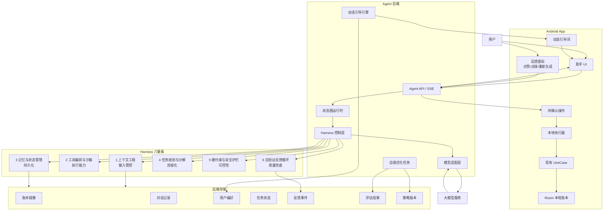
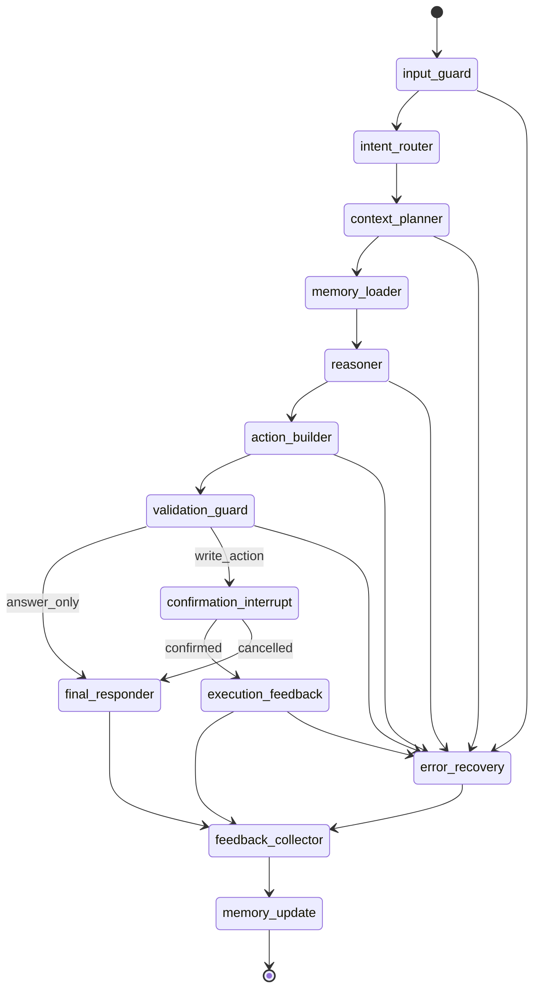
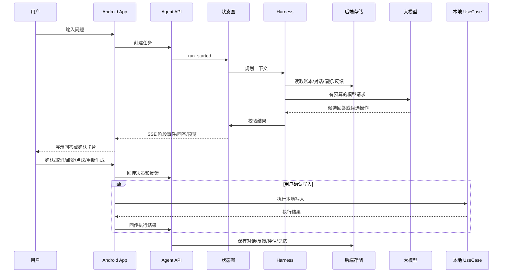

# Agent 助手架构

本文档定义 Keacs 的通用 Agent Runtime。当前实现服务记账助手，长期目标是让同一个 Agent 对话、消息卡片、工具调用、确认中断和模型适配能力复用于记账、待办、搜索/攻略、资产观察等 Capability Modules。

## 1. 架构边界

| 模块 | 职责 | 禁止 |
| --- | --- | --- |
| Android App | 对话展示、动态引导展示、反馈采集、确认卡片、本地写入执行、本地任务恢复 | 模型直接写库、绕过确认执行写入 |
| Agent 后端 | Harness 编排、状态图运行、上下文组织、模型调用、长期记忆、自我优化、动态引导生成 | 替 App 写本地账本、自动发布未验证的全局策略 |
| 大模型 | 意图理解、候选回答、候选操作、摘要生成、引导词候选生成 | 决定最终写入、声明写入已完成 |
| 本地 UseCase | 新增、修改、删除、定时记账等真实写入 | 接收未经确认的 Agent 写入 |
| 后端存储 | 账本镜像、对话、偏好、反馈、运行状态、评估结果、策略版本 | 用户自定义 API Key、设备原始标识 |

平台化约束：

- Agent Runtime 不属于某个单一模块，模块通过工具和上下文接口接入。
- Agent UI 是公共组件族，不能写死记账字段；记账字段只出现在记账模块提供的 ActionPreview 内容中。
- 写入类工具只生成操作草稿和确认卡片，真实写入由模块本地 UseCase 或等价业务入口执行。
- 模型 Provider 可替换，可接入官方后端、自定义 OpenAI 兼容服务、未来 iOS 本地模型或其他受控模型服务。

## 2. 总体架构

## 3. Harness 六大要素

| 要素 | 后端模块 | 输入 | 输出 | 关键约束 |
| --- | --- | --- | --- | --- |
| 上下文工程（输入管控） | `ContextBudgeter`、`ContextRetriever`、`PromptAssembler`、`SuggestionContextBuilder` | 用户输入、日期、对话、账本、偏好、反馈、任务状态 | 有预算的模型上下文、动态引导上下文、摘要和检索结果 | 单次调用限制 token、耗时、成本；禁止用户自定义 API Key 入模；长对话先摘要再检索 |
| 工具编排与沙箱（执行能力） | `ToolRegistry`、`ToolSandbox`、`ActionBuilder`、`PreviewBuilder` | 状态图节点请求、模型候选操作、上下文观察结果 | 结构化操作、确认预览、工具观察结果 | 工具 Schema 固定；工具超时和重试受控；后端工具不得直接写本地账本 |
| 记忆与状态管理（持久化） | `RunStore`、`ConversationStore`、`LedgerStore`、`ProfileStore`、`Checkpointer` | 完整账本、完整对话、任务阶段、用户偏好、模型输入输出 | 任务检查点、用户画像、账本摘要、长期记忆 | 允许保存完整数据；设备 ID 只存不可逆摘要；自定义 API Key 不入库 |
| 任务规划与分解（流程化） | `AgentGraph`、`IntentRouter`、`PlannerNode`、`ContextNode`、`ReasonNode`、`ConfirmNode`、`FinalNode` | 用户目标、当前状态、上下文预算、工具结果 | 可恢复任务流、阶段事件、上下文请求、待确认动作 | 写入任务必须进入确认节点；任务状态只按图推进；失败进入恢复节点 |
| 硬约束与安全护栏（可控性） | `InputGuard`、`ActionValidator`、`PolicyGuard`、`WriteGuard`、`RateLimiter` | 用户输入、模型输出、操作预览、执行结果 | 拦截结果、可读错误、重试指令、安全警告 | 金额、日期、分类、账户必须校验；禁止跳过确认；禁止模型声明已写入 |
| 自验证反馈循环（质量兜底） | `FeedbackCollector`、`RunScorer`、`MemoryUpdater`、`PromptEvaluator`、`PolicyOptimizer` | 点赞、点踩、重新生成、追问、取消、执行失败、耗时、错误 | 质量评分、用户记忆更新、提示词候选、路由优化候选 | 个人记忆可自动更新；全局提示词、工具路由和状态图变更需评估后发布 |

## 4. 任务状态图

## 5. 数据流

## 6. 存储结构

| 存储 | 内容 | 用途 |
| --- | --- | --- |
| `ledger_store` | 账本镜像、统计摘要、明细索引 | 查账、复盘、上下文检索 |
| `conversation_store` | 用户消息、助手消息、模型输入输出 | 多轮对话、质量评估、个性化 |
| `profile_store` | 常用分类、账户、表达习惯、回答偏好 | 个性化理解、动态引导 |
| `run_store` | 任务 ID、阶段、状态、检查点、错误 | 任务恢复、审计、调试 |
| `feedback_store` | 点赞、点踩、重新生成、取消、失败 | 质量评分、自我优化 |
| `evaluation_store` | 完成率、重试率、耗时、成本、评分 | 策略评估、版本对比 |
| `policy_store` | 提示词版本、路由规则、上下文策略 | 灰度、回滚、发布控制 |

## 7. 接口

| 接口 | 方法 | 作用 |
| --- | --- | --- |
| `/health` | `GET` | 健康检查 |
| `/api/agent/runs/stream` | `POST` | 创建任务并返回 SSE |
| `/api/agent/runs/{runId}/context` | `POST` | App 回传本地上下文观察结果 |
| `/api/agent/runs/{runId}/resume` | `POST` | App 回传确认、取消或执行结果 |
| `/api/agent/runs/{runId}/feedback` | `POST` | 回传点赞、点踩、重新生成 |
| `/api/agent/suggestions` | `POST` | 获取动态引导词 |
| `/api/agent/chat` | `POST` | 旧版本兼容 |
| `/api/agent/feedback` | `POST` | 旧版本兼容 |

## 8. 前端能力

| 能力 | UI 位置 | 数据来源 |
| --- | --- | --- |
| 任务阶段 | 消息流内轻量状态 | SSE `stage_changed` |
| 流式回复 | 助手消息 | SSE `partial_message`、`final_message` |
| 确认卡片 | 助手消息下方 | SSE `action_preview` |
| 点赞/点踩/重新生成 | 助手消息右下角小图标 | `AgentFeedbackEvent` |
| 动态引导词 | 输入框上方或会话底部 | `/api/agent/suggestions` |
| 待确认恢复 | 进入助手页时 | `agent_pending_actions`、`run_store` |

## 9. 公共 Agent UI 组件族

| 组件 | 职责 | 复用边界 |
| --- | --- | --- |
| `AgentChatSurface` | 承载消息流、滚动、空态、任务状态和底部输入区 | 可在首页、模块详情页、独立助手页复用 |
| `AgentInputComposer` | 多行文本输入、发送、停止、重试和语音转文字入口 | 不直接调用模型，只发出输入事件 |
| `AgentMessageCard` | 展示用户消息、助手回复、错误、工具结果和 Markdown 内容 | 不包含模块业务写入逻辑 |
| `ActionPreviewCard` | 展示待确认操作、风险提示、确认、取消和编辑入口 | 操作字段由模块提供 Schema |
| `TaskStageCard` | 展示正在理解、读取上下文、调用工具、等待确认等阶段 | 阶段文案必须用户可理解 |
| `SuggestionChips` | 展示动态引导词和快捷提问 | 不遮挡确认卡片和错误提示 |

组件规则：

- Markdown 渲染由公共文本组件提供，AgentMessageCard 只负责排版和交互。
- 语音转文字入口只负责录音权限、识别状态和转写文本回填，不直接发送消息。
- 反馈按钮只绑定助手消息，不出现在用户消息、系统错误或未完成阶段卡片上。
- 长任务必须显示阶段，不展示内部提示词、原始工具参数或原始账本 JSON。

## 10. 模块工具契约

每个 Capability Module 至少声明：

- 模块 ID、名称、可用入口和权限需求。
- 可读取上下文摘要，例如账本统计、待办摘要、搜索结果或资产观察摘要。
- 可调用工具列表，包括工具名、用途、输入、输出、错误和是否需要确认。
- 写入操作草稿 Schema，用于生成 ActionPreviewCard。
- 执行结果 Schema，用于回传成功、取消、本地校验失败或网络失败。

工具约束：

- 查询工具可以直接返回结构化观察结果。
- 写入工具不能直接执行，只能返回 `ActionDraft` 或等价操作草稿。
- 高风险工具必须标记风险级别，并触发更明确的确认卡片。
- 模块工具变更必须补充模块 PRD 和必要测试要求。

## 11. 发布约束

| 变更 | 发布要求 |
| --- | --- |
| 用户个人记忆 | 可自动更新 |
| 动态引导词排序 | 可自动更新 |
| 上下文选择阈值 | 需评估指标通过 |
| 提示词版本 | 需离线评估或人工确认 |
| 工具路由规则 | 需离线评估或人工确认 |
| 状态图结构 | 需人工确认和回归测试 |
